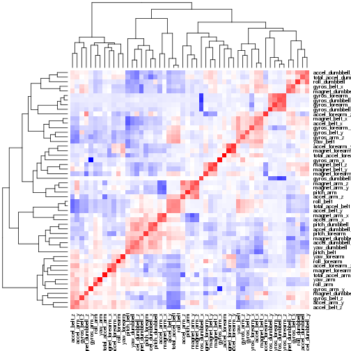
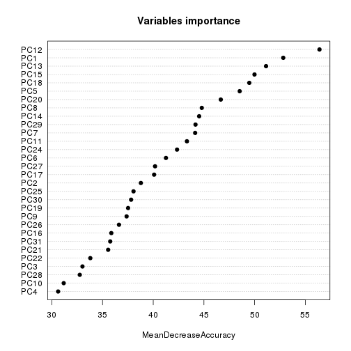

Predictive Analysis of Excercise Data
========================================================

## Abstract
This assignment has the objective of studying the relations of several motion sensors applied to the body and how a exercise is done. 
The data used in this project was downloaded from the following webpage:
http://groupware.les.inf.puc-rio.br/har


## Data loading
First it is necessary to download the needed data.
The database was divided into two sets, a training and a test one that will be used only at the end of the analysis.

```r
if (!file.exists("./pml-training.csv")) {
    download.file("http://d396qusza40orc.cloudfront.net/predmachlearn/pml-training.csv", 
        destfile = "./pml-training.csv")
}
if (!file.exists("./pml-testing.csv")) {
    download.file("http://d396qusza40orc.cloudfront.net/predmachlearn/pml-testing.csv", 
        destfile = "./pml-testing.csv")
}

trainFull = read.csv("pml-training.csv")
testFull = read.csv("pml-testing.csv")
```

Lets also load the required libraries and set the seed for the analysis.

```r
library(caret)
```

```
## Loading required package: lattice
## Loading required package: ggplot2
```

```r
set.seed(2137)
```

## Exploratory analysis

With the data loaded, it is time for some exploratory analysis. First some of the data is not related to the exercise, but identifiers for the time the data as collected or the user from which it was measured and should be removed. Those are the variables X, user_name, raw_timestamp_part1, raw_timestamp_part2, cvtd_timestamp, new_window and num_window.


```r
drops = c("X", "user_name", "raw_timestamp_part_1", "raw_timestamp_part_2", "cvtd_timestamp", "new_window", "num_window")
trainFiltered = trainFull[, !(names(trainFull) %in% drops)]
```

One aspect noted is that there a large number of entries that are not complet, filled with NA. This reduce the number of possible data for training drastically


```r
dim(trainFiltered)
```

```
## [1] 19622   153
```

```r
sum(complete.cases(trainFiltered))
```

```
## [1] 406
```

To increase the number of entries for the training, it is necessary to remove all variables that are not complete or empty.

```r
trainFiltered = trainFiltered[, (colSums(is.na(trainFiltered)) == 0)]
sum(complete.cases(trainFiltered))
```

```
## [1] 19622
```

To remove the empty ones:

```r
nums = sapply(trainFiltered[, names(trainFiltered) != "classe"], is.numeric)
trainFiltered = trainFiltered[,c(nums,"classe"=TRUE)]
testFiltered = testFull[,names(trainFiltered[, names(trainFiltered) != "classe"])]
```

Next,we should remove variables that are too related to each other, ie, have a high correlation between them. First we should check if there is any of those variables.

```r
correlation = cor(trainFiltered[, names(trainFiltered) != "classe"])
pallet = colorRampPalette(c("blue", "white", "red"))(n = 199)
heatmap(correlation, col = pallet)
```

 

### Preprocessing
As it can be seen by the correlation graph shown in the last session, there are still some variables that are highly correlated with each other. We can use Principal Component Analysis to remove these variables. But first we need to split the training set to create a cross validation set.


```r
inTrain = createDataPartition(trainFiltered$class, p = 0.6, list = FALSE)
trainSet = trainFiltered[inTrain,]
cvSet = trainFiltered[-inTrain,]
```

Now for the principal component analysis


```r
preP = preProcess(trainSet[, names(trainSet) != "classe"], method = "pca", thresh = 0.98)
trainPP = predict(preP, trainSet[, names(trainSet) != "classe"])
cvPP = predict(preP, cvSet[, names(trainSet) != "classe"])
dim(trainPP)
```

```
## [1] 11776    31
```

Now with the variables reduced to 25, we can begin training.


## Training
The algorithm chosen to train the was the Random Forest due to its well know accuracy for classification problems.

```
## Loading required package: randomForest
## randomForest 4.6-10
## Type rfNews() to see new features/changes/bug fixes.
```
Then lets plot the importance of each one of the calculated principal components.This graph illustrate the contribuition of each component to the predition. 


```r
varImpPlot(fitModel$finalModel, sort = TRUE, type = 1, pch = 19, col = 1, cex = 1,main = "Variables importance")
```

 

## Prediction
Now that the classifier is trained it is time to check its accuracy on our test set.

```r
cvRes = predict(fitModel, cvPP)
confMatrix = confusionMatrix(cvSet$classe, cvRes)
confMatrix$table
```

```
##           Reference
## Prediction    A    B    C    D    E
##          A 2216    4    5    7    0
##          B   29 1465   22    2    0
##          C    6   20 1329    9    4
##          D    2    0   68 1211    5
##          E    3    6   14    6 1413
```

This show us wich class is being classified better.
To get a more direct measurement of accuracy, we can do as follows.

```r
accuracy = postResample(cvSet$classe, cvRes)
accuracy[[1]]
```

```
## [1] 0.9729799
```
And our misclassification rate will be 1 - accuracy

```r
1 - accuracy[[1]]
```

```
## [1] 0.02702014
```

## Predicting results
As a last step, lets use the computed classifier to predic the results on the test set.

```r
testPP = predict(preP, testFiltered[, names(testFiltered) != "classe"])
predict(fitModel,testPP)
```

```
##  [1] B A A A A E D B A A B C B A E E A B B B
## Levels: A B C D E
```
